# martine

After Claudia from Eliot a long time ago, here is coming Martine.
A cli which converts JPEG or PNG image file into  SCR/PAL or Overscan  Amstrad CPC file screen.
Multi os, you can convert any pictures to Amstrad CPC Screen.
The files generated (.win, .scr, .ink) are compatible with [OCP art studio](http://www.cpc-power.com/index.php?page=detail&num=4963) and Impdraw V2 [i2](http://amstradplus.forumforever.com/t462-iMPdraw-v2-0.htm)

# Contents :
 * [Introduction](#Introduction)
 * [Output files](#Output_files)
 * [Options](#Options)
 * [Installation](#Installation)
 * [GUI/UI](#GUI)
 * [Usage](#Usage)
 * [Technics](#Technics)
	* [Screen Conversion](#Screen_conversion)
	* [Roll sprite](#Roll)
	* [Tiles](#Tiles)
	* [Rotation Sprite](#Rotation)
	* [3D Rotation](#3D_rotation)
	* [Tilemap](#Tilemap)
	* [Flash](#flash)
	* [Split Rasters](#SplitRasters)
	* [Egx](#Egx)
	* [Deltapacking](#Deltapacking)
	* [Animation](#Animation)
	* [Advanced Features](#Advanced)

## Introduction 
Martine tries to accelerate your game, demo animation development by organize and conversion of your graphical data.
All screens data are associated with basic programs launchers to quick display the output on real machines.
You can follow the development here [Cpcwiki in english](https://www.cpcwiki.eu/forum/applications/martine-a-cpc-old-plus-tool-to-handle-your-images/) or here [Amstrad plus forum in french](https://amstradplus.forumforever.com/t513-martine-fait-du-dessin.htm) <br>
A Gui was developed for windows users by Tronic you can get it [here](https://index.amstrad.info/wp-content/uploads/martine/)


## Output_files
Output:
Martine generates a lot of differents files, which allow you to find the format and the data you will use.

### files generated :  
 * .win or .scr sprite or screen files
 * .pal or .ink palette file (.ink will be generated if the -plus option is set)
 * .txt ascii file with palettes values (firmware values and basic values), and screen byte values
 *  c.txt ascii file with palettes values (firmware values and basic values), and screen byte values by column
 * .json json file with palettes values (firmware values and basic values), and screen byte values
 * .bas launch to test the screen load on classic .scr 17ko 
 * _resized.png images files to ensure the resize action
 * _downgraded.png images files to ensure the downgraded palette action
 * _paletteink.png palette image describing the CPC old colors used
 * _palettepal.png palette image describing the CPC old colors used
 * _palettekit.png palette image describing the CPC plus colors used

## Options 
### additionnals options available : 
* -dsk will generate a dsk file and add all amsdos files will be added.
* -noheader will remove amsdos headers from the amsdos files
* -fullscreen will generate overscan screen amsdos file
* -plus will generate a CPC plus screen amsdos file
* -height will generate sprite of x pixel high
* -width will generate sprite of x pixel wide
* -statement to define the byte token will be replace the byte token in the ascii files
* -algo to set the algorithm to downsize the image
* -mode  to define the screen mode 0,1,2
* -out to set the output directory (is not exists, martine will create the folder).
* -z compress the image .scr / .win (not overscan) using the algorithm.
* -zigzag will generate data output as zigzag.
* -scanlinesequence will generate the lines following the input sequence such as 0,7,1,2,3,4,5,6 for instance.
* -sla will rotate x column pixels from the left, those columns will be discarded  
* -sra will rotate x column pixels from the right, those columns will be discarded  
* -rra will rotate x column pixels from the right
* -rla will rotate x column pixels from the left
* -keephigh will rotate x line pixels to the top
* -keeplow will rotate x line pixels to the bottom
* -losthigh will rotate x line pixels to the top, those lines will be discarded 
* -lostlow will rotate x line pixels to the bottom, those lines will be discarded
* -sna copy output files in a new CPC image Sna.
* -reducer reducing color filter (3 gradients are available)
* -mask string
    	Mask to apply on each bit of the sprite (to apply an and operation on each pixel with the value #AA [in hexdecimal: #AA or 0xAA, in decimal: 170] ex: martine -in myimage.png -width 40 -height 80 -mask #AA -mode  0 -maskand)
* -maskand 	Will apply an AND operation on each byte with the mask
* -maskor Will apply an OR operation on each byte with the mask
* -tilemap
    	Analyse the input image and generate the tiles, the tile map and gloabl schema.
* -spritehard will generate 16x16 bits sprite hard for CPC plus.
* -splitrasters will generate a rastered screen 
* -reverse create a png image from your .scr .win file

### hardware options (if you owns a M4 Card, you can transfert your results by Wifi to your CPC using those options) : 
* -host ip or dns name of your M4.
* -autoexec will execute the launcher or sna file on your remote CPC.


## Installation

To Install and compile
```
go get github.com/jeromelesaux/martine
cd $GOPATH/src/github.com/jeromelesaux/martine
go get 
go build
```

To get binary : 
[https://github.com/jeromelesaux/martine/releases](https://github.com/jeromelesaux/martine/releases)
<br>OS avaible : Linux, Macos X and Windows  

## GUI/UI

### Overview
Martine includes a cross-platform graphical user interface (GUI) built with [Fyne](https://fyne.io), a modern Go GUI framework. The GUI provides an intuitive way to access all martine features without using the command line.

### Features
The GUI includes tabbed interfaces for different operations:

* **Image Tab** - Configure input images, preview settings, and manage image-specific options
* **Sprite Tab** - Configure sprite generation with width/height, mode selection, and sprite-specific transformations
* **Tilemap Tab** - Define tilemap parameters and analyze tile-based images
* **Animation Tab** - Handle GIF and multi-frame processing for animations and rotations
* **EGX Tab** - Configure EGX mode mixing (modes 0/1 or 1/2) with preview
* **Palette Management** - Load, apply, and manage color palettes (PAL, INK, KIT formats)
* **Settings/Preferences** - Configure output directory, theme, and global options

### Running the GUI
The GUI can be started by running:
```
cd ui
go run ui.go
```

Or use a compiled binary from the releases.

### GUI Features
- Real-time image preview with conversion effects
- Drag-and-drop file loading
- Batch processing capabilities
- Live palette visualization
- Output file browser
- Process template save/load functionality

## Usage
Usage and options : 

```
./martine
martine convert (jpeg, png format) image to Amstrad cpc screen (even overscan)
By Impact Sid (Version:0.29)
Special thanks to @Ast (for his support), @Siko and @Tronic for ideas
usage :

  -address string
        Starting address to display sprite in delta packing (default "0xC000")
  -algo int
        Algorithm to resize the image (available : 
                1: NearestNeighbor (default)
                2: CatmullRom
                3: Lanczos
                4: Linear
                5: Box
                6: Hermite
                7: BSpline
                8: Hamming
                9: Hann
                10: Gaussian
                11: Blackman
                12: Bartlett
                13: Welch
                14: Cosine
                15: MitchellNetravali
                 (default 1)
  -animate
        Will produce an full screen with all sprite on the same image (add -in image.gif or -in *.png)
  -autoexec
        Execute on your remote CPC the screen file or basic file.
  -brightness int
        apply brightness on the color of the palette on amstrad plus screen. (max value 100 and only on CPC PLUS).
  -contrast int
        apply contrast on the color of the palette on amstrad plus screen. (max value 100 and only on CPC PLUS).
  -delta
        Delta mode: compute delta between two files (prefixed by the argument -df)
                (ex: -delta -df file1.SCR -df file2.SCR -df file3.SCR).
                (ex with wildcard: -delta -df file\?.SCR or -delta file\*.SCR
  -deltapacking
        Will generate all the animation code from the followed gif file.
  -df value
        scr file path to add in delta mode comparison. (wildcard accepted such as ? or * file filename.) 
  -dithering int
        Dithering algorithm to apply on input image
        Algorithms available:
                0: FloydSteinberg
                1: JarvisJudiceNinke
                2: Stucki
                3: Atkinson
                4: Sierra
                5: SierraLite
                6: Sierra3
                7: Bayer2
                8: Bayer3
                9: Bayer4
                10: Bayer8
         (default -1)
  -dsk
        Copy files in a new CPC image Dsk.
  -egx1
        Create egx 1 output cpc image overscan (option -fullscreen) or classical (mix mode 0 / 1).
                (ex before generate two images one in mode 1 et one in mode 0
                for instance : martine -in myimage.jpg -mode 0 and martine -in myimage.jpg -mode 1
                : -egx1 -in 1.SCR -mode 0 -pal 1.PAL -in2 2.SCR -out test -mode2 1 -dsk)
                or
                (ex automatic egx from image file : -egx1 -in input.png -mode 0 -out test -dsk)
  -egx2
        Create egx 2 output cpc image overscan (option -fullscreen) or classical (mix mode 1 / 2).
                (ex before generate two images one in mode 1 et one in mode 2
                for instance : martine -in myimage.jpg -mode 0 and martine -in myimage.jpg -mode 1
                : -egx2 -in 1.SCR -mode 0 -pal 1.PAL -in2 2.SCR -out test -mode2 1 -dsk)
                or
                (ex automatic egx from image file : -egx2 -in input.png -mode 0 -out test -dsk)
  -extendeddsk
        Export in a Extended DSK 80 tracks, 10 sectors 400 ko per face
  -fillout
        Fill out the gif frames needed some case with deltapacking
  -flash
        generate flash animation with two ocp screens.
                (ex: -mode 1 -flash -in input.png -out test -dsk)
                or
                (ex: -mode 1 -flash -i input1.scr -pal input1.pal -mode2 0 -iin2 input2.scr -pal2 input2.pal -out test -dsk )
  -fullscreen
        Overscan mode (default no overscan)
  -height int
        Custom output height in pixels. (Will produce a sprite file .win) (default -1)
  -help
        Display help message
  -host string
        Set the ip of your M4.
  -imp
        Will generate sprites as IMP-Catcher format (Impdraw V2).
  -in string
        Picture path of the input file.
  -in2 string
        Picture path of the second input file (flash mode)
  -info
        Return the information of the file, associated with -pal and -win options
  -initprocess string
        Create a new empty process file.
  -ink string
        Path of the palette Cpc ink file. (Apply the input ink palette on the image)
  -inkswap string
        Swap ink:
                for instance mode 4 (4 inks) : 0=3,1=0,2=1,3=2
                will swap in output image index 0 by 3 and 1 by 0 and so on.
  -iter int
        Iterations number to walk in roll mode, or number of images to generate in rotation mode. (default -1)
  -iterx int
        Number of tiles on a row in the input image. (default 1)
  -itery int
        Number of tiles on a column in the input image. (default 1)
  -json
        Generate json format output.
  -keephigh int
        Bit rotation on the top and keep pixels (default -1)
  -keeplow int
        Bit rotation on the bottom and keep pixels (default -1)
  -kit string
        Path of the palette Cpc plus Kit file. (Apply the input kit palette on the image)
  -linewidth string
        Line width in hexadecimal to compute the screen address in delta mode. (default "#50")
  -losthigh int
        Bit rotation on the top and lost pixels (default -1)
  -lostlow int
        Bit rotation on the bottom and lost pixels (default -1)
  -mask string
        Mask to apply on each bit of the sprite (to apply an and operation on each pixel with the value #AA [in hexdecimal: #AA or 0xAA, in decimal: 170] ex: martine -in myimage.png -width 40 -height 80 -mask #AA -mode 0 -maskand)
  -maskand
        Will apply an AND operation on each byte with the mask
  -maskor
        Will apply an OR operation on each byte with the mask
  -mode int
        Output mode to use :
                0 for mode0
                1 for mode1
                2 for mode2
                and add -fullscreen option for overscan export.
                 (default -1)
  -mode2 int
        Output mode to use :
                0 for mode0
                1 for mode1
                2 for mode2
                mode of the second input file (flash mode) (default -1)
  -multiplier float
        Error dithering multiplier. (default 1.18)
  -noheader
        No amsdos header for all files (default amsdos header added).
  -oneline
        Display every other line.
  -onerow
        Display  every other row.
  -out string
        Output directory
  -pal string
        Apply the input palette to the image
  -pal2 string
        Apply the input palette to the second image (flash mode)
  -plus
        Plus mode (means generate an image for CPC Plus Screen)
  -processfile string
        Process file path to apply.
  -quantization
        Use additionnal quantization for dithering.
  -reducer int
        Reducer mask will reduce original image colors. Available : 
                1 : lower
                2 : medium
                3 : strong
         (default -1)
  -remotepath string
        Remote path on your M4 where you want to copy your files.
  -reverse
        Transform .scr (overscan or not) file with palette (pal or kit file) into png file
  -rla int
        Bit rotation on the left and keep pixels (default -1)
  -roll
        Roll mode allow to walk and walk into the input file, associated with rla,rra,sra,sla, keephigh, keeplow, losthigh or lostlow options.
  -rotate
        Allow rotation on the input image, the input image must be a square (width equals height)
  -rotate3d
        Allow 3d rotation on the input image, the input image must be a square (width equals height)
  -rotate3dtype int
        Rotation type :
                1 rotate on X axis
                2 rotate on Y axis
                3 rotate reverse X axis
                4 rotate left to right on Y axis
                5 diagonal rotation on X axis
                6 diagonal rotation on Y axis
    
  -rotate3dx0 int
        X0 coordinate to apply in 3d rotation (default width of the image/2) (default -1)
  -rotate3dy0 int
        Y0 coordinate to apply in 3d rotation (default height of the image/2) (default -1)
  -rra int
        Bit rotation on the right and keep pixels (default -1)
  -scanlinesequence string
        Scanline sequence to apply on sprite. for instance : 
                martine -in myimage.jpg -width 4 -height 4 -scanlinesequence 0,2,1,3 
                will generate a sprite stored with lines order 0 2 1 and 3.
    
  -sla int
        Bit rotation on the left and lost pixels (default -1)
  -sna
        Copy files in a new CPC image Sna.
  -splitrasters
        Create Split rastered image. (Will produce Overscan output file and .SPL with split rasters file)
  -spritehard
        Generate sprite hard for cpc plus.
  -sra int
        Bit rotation on the right and lost pixels (default -1)
  -statement string
        Byte statement to replace in ascii export (default is db), you can replace or instance by defb or byte
  -tile
        Tile mode to create multiples sprites from a same image.
  -tilemap
        Analyse the input image and generate the tiles, the tile map and global schema.
                 for instance: martine -in board.png -mode 0 -width 8 -height 8 -out folder -dsk
    
  -txt
        Generate text format output.
  -version
        print martine's version
  -width int
        Custom output width in pixels. (Will produce a sprite file .win) (default -1)
  -win string
        Filepath of the ocp win file
  -z int
        Compression algorithm : 
                1: rle (default)
                2: rle 16bits
                3: Lz4 Classic
                4: Lz4 Raw
                5: zx0 crunch
         (default -1)
  -zigzag
        generate data in zigzag order (inc first line and dec next line for tiles)
```
## Technics
Principles : 
Martine can be used in several modes : 
 * first mode : conversion of an input image into sprite (file .win), cpc screen (file .scr) and overscan screen (larger file .scr)
 * second mode : rotate line or column pixels of an input image (option -roll)
 * bulk conversion of a tiles page : each sprites of the same width and height will be converted to sprites (files .win, option -tile)
 * rotate an existing image, will produce images rotated
 * 3d rotate an existing image on an axis.
 * egx mode screen generation (screen which alternates 2 modes (0,1,2) each line).
 * delta packing, allows you to create your own animation using the less memory as possible, keeping the maximum of speed.
 * tilemap generate the map of tiles and sprites of the input map.
 * split raster to generate a rastered screen
 * flash to generate a flash screen

examples :
### Screen_conversion 
* convert samples/Batman-Neal-Adams.jpg 

  * in mode 0 
```martine -in samples/Batman-Neal-Adams.jpg -mode  0```
  * in mode 1 
```martine -in samples/Batman-Neal-Adams.jpg -mode  1```
  * in mode 2 
```martine -in samples/Batman-Neal-Adams.jpg -mode  2```
  * in mode 0 in overscan : 
```martine -in samples/Batman-Neal-Adams.jpg -mode  0 -f```
  * in mode 0 overscan for Plus series :
```martine -in samples/Batman-Neal-Adams.jpg -mode  0 -fullscreen -p```
  * to get sprites (40 pixels wide)
```martine -in samples/Batman-Neal-Adams.jpg -mode  0 -width 40```
  * roll mode to do an rra operation on the image (will create 16 sprites with a rra operation on the first pixels on the left)
	```martine -in samples/Batman-Neal-Adams.jpg -mode  0 -width 40 -roll -rra 1 -iter 16```	

Samples : 
```martine -in samples/Batman-Neal-Adams.jpg -mode  0 -f```

input       
 
 will resize the image and save it 

 

 after downgrade the colors palette : 

 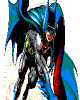

 results on a CPC emulator : 

 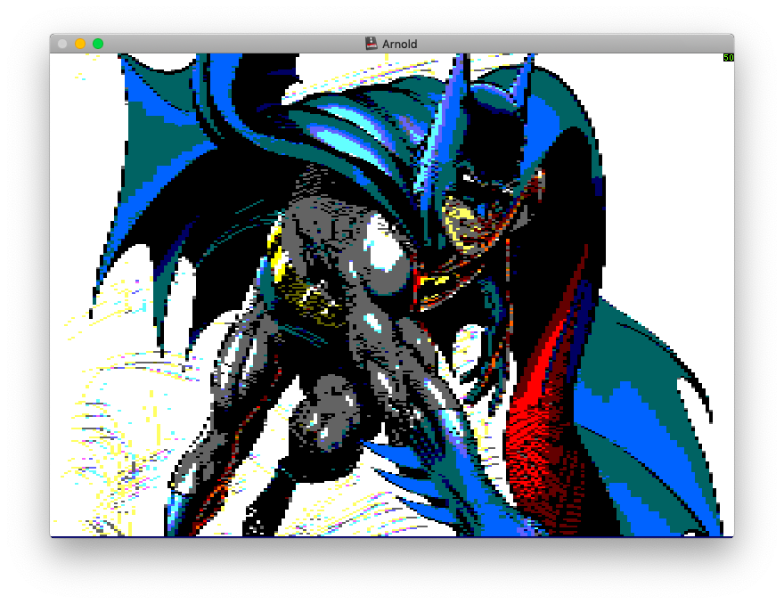

 


### Roll : 

```martine -in samples/rotate.png -mode  0 -width 16 -height 16 -roll -rra 1 -iter 16```

input 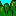

sames phasis reduce size and downgrade colors palette to CPC palette. 

after rotate the first pixels' column in 16 differents images : 

 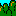
 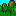
 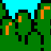
 
 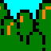
 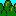
 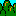
 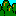
 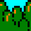
 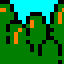
 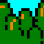
 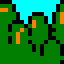
 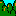
 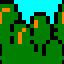
 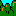
 

 with the same image, to rotate the pixels line : 

 ```martine -in samples/rotate.png -mode  0 -width 16 -height 16 -roll -keephigh 2 -iter 16 ```

 will produce images : 

 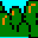
 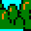
 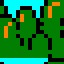
 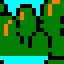
 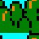
 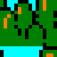
 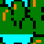
 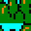
 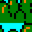
 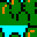
 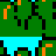
 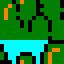
 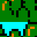
 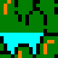
 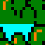
 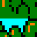

 

### Tiles :

this option will extract all the tiles from an image and generate the sprites files. 
sample usage : 
```martine -in samples/tiles.png -tile -width 64 -iterx 14 -itery 7 -mode  0 ```

input 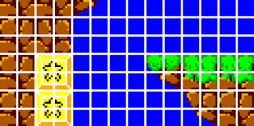

This command will generate 14*7 sprites of 64 pixels large.
Warn, all sprite must have the same size.

 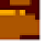
 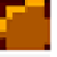
 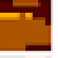
 
 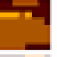
 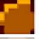
 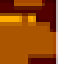
 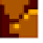
 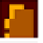
 
 
 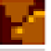
 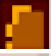
 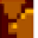
 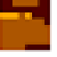
 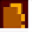
 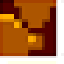
 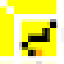
 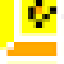
 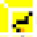
 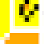


### Rotation : 
This option able to rotate the input image, iter will generate the number of images.
```martine -in images/coke.jpg -rotate -iter 16 -out test  -mode  1 -width 32 -height 32```

Input : 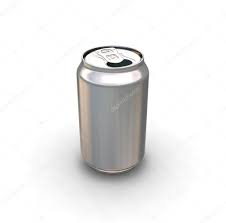

results : 


### 3D_rotation
This option able to rotate the input image on an axis (X or Y and even on a diagonal), iter will generate the number of images. 
```./martine -mode  0 -width 64 -height 64 -rotate3d -rotate3dtype 2 -out test/ -in images/sonic.png  -iter 12```

Input : 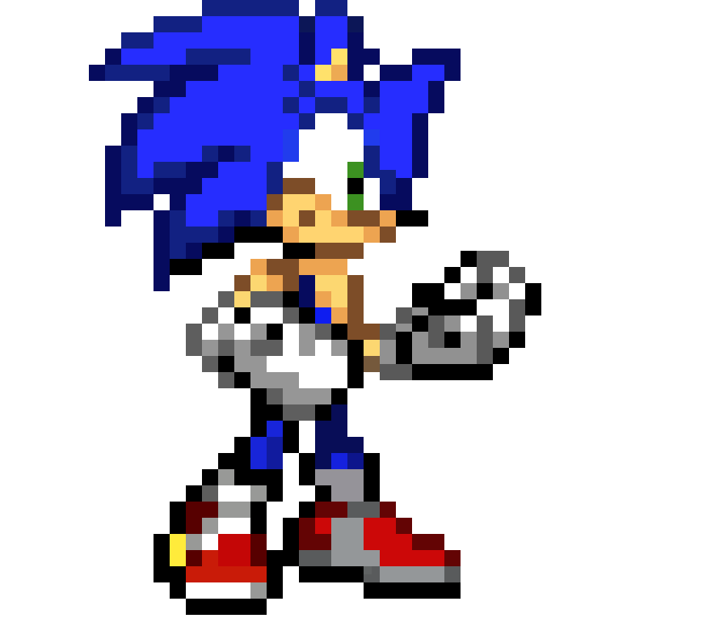

Results: 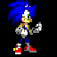

### flash 

The flash effect creates animated transitions between two CPC screens. This technique simulates a flickering or flashing animation by rapidly switching between two different screens, which was a popular technique on retro systems.

#### Basic Usage
```martine -mode 1 -flash -in input.png -out test -dsk```

This command automatically generates two complementary images optimized for flashing animation.

#### Manual Two-Screen Mode
You can provide two pre-generated screens for more control:
```martine -mode 1 -flash -in input1.scr -pal input1.pal -mode2 0 -in2 input2.scr -pal2 input2.pal -out test -dsk```

#### Features
- Generates BASIC launcher to test animation on real CPC
- Compatible with both classic and overscan screens
- Supports mode mixing (e.g., mode 0 + mode 1)
- Optional DSK file generation for direct CPC loading
- Works with SNA snapshot format for emulators

#### Example
Starting with an image:
```martine -mode 1 -flash -in samples/lara.png -out flash_output -dsk```

This produces:
- Two `.SCR` files with complementary color schemes
- Two `.PAL` palette files
- `.BAS` BASIC program to display the animation
- Complete `.DSK` disk image ready for CPC

The resulting animation creates a flickering effect that can simulate transparency or add visual interest to your demo scene.

### tilemap
This option allows to create allow tiles and tile map from the input image. If for instance you use the mario level 1 like this : 
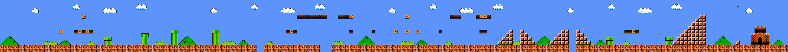
```martine -in mario-level1.png -width 16 -height 16 -tilemap -out Mario-level1```

By this command line, martine will analyse the image to find all tiles 16 pixels high and 16 pixels wide. It will keep in memory the tile position to produce the tile map.
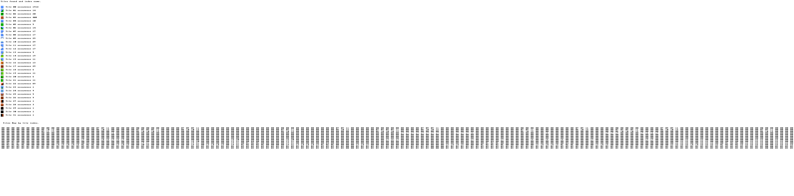
A csv ot the same tile map is also created (tilesmap.asm).
Martine will also generate all tiles found.
-  tile 00 
-  tile 01
- 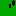 tile 02
- 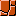 tile 03
-  tile 04
-  tile 05 
-  tile 06
-  tile 07
-  tile 08
-  tile 09
-  tile 10 
-  tile 11
-  tile 12
-  tile 13
-  tile 14
-  tile 15 
-  tile 16
- 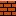 tile 17
- 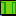 tile 18
- 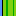 tile 19
- 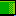 tile 20 
- 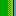 tile 21
-  tile 22
-  tile 23
-  tile 24
- 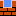 tile 25 
- 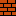 tile 26
-  tile 27
- 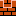 tile 28
-  tile 29
- 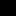 tile 30 
-  tile 31

and the palette for each tile for instance : 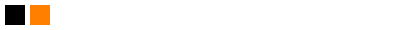
### Egx
The egx mode was introduced by Targhan in his game Ishido. 
This mode alternate differents screen mode. First line in mode 1, second line mode in mode 0, third in mode 1 etc ...

Two differents formats are available egx1 and egx2 : 
* egx1 alternates mode 0 and mode 1
* egx2 alternates mode 1 and mode 2

Martine lets the user to choose the input images. Like this you can combine dithering in the image mode 1, to get a better render.

In this example I will use this image : 
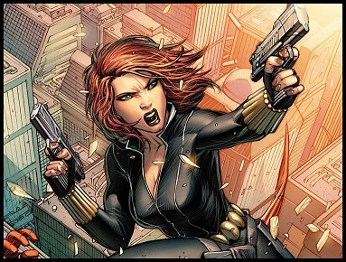

So you need to generate two images in differents modes such as follow : 
```
martine -in images/bwind.jpg -mode  0 -out egx_bwind/mode0 -f
martine -in images/bwind.jpg -mode  1 -dithering 10 -out egx_bwind/mode1 -f
```
results : 
* mode 0 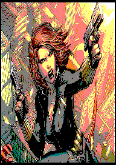
* mode 1 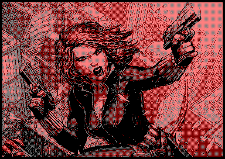

It's important to generate in differents folders, martine will erase the files generated by the first command.

Now create the egx file by the command : 
```
martine -egx1 -mode  0 -in egx_bwind/mode0/BWINND.SCR -m2 1 -i2 egx_bwind/mode1/BWINND.SCR -out egx_bwind/ -pal egx_bwind/mode0/BWINND.PAL -fullscreen -dsk
```
will produce 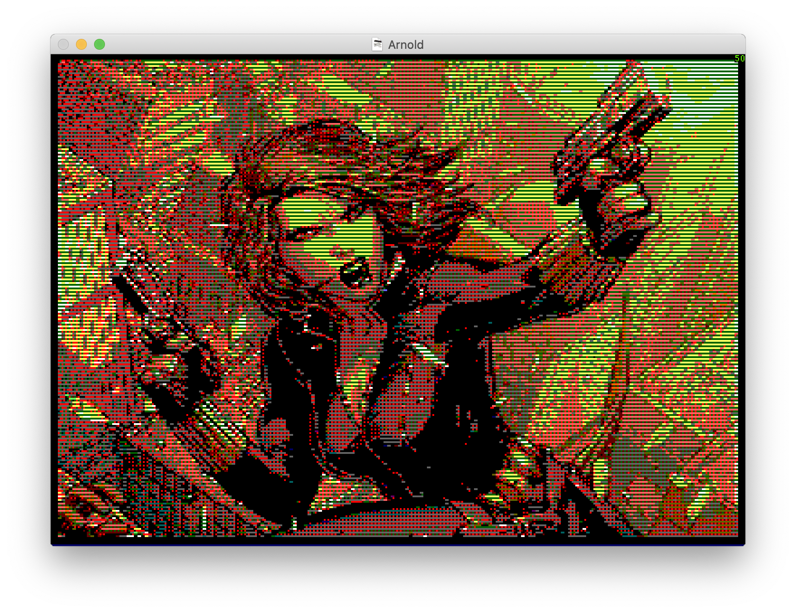

Some explanations : <br>
I choose here to be in full screen (option -f).
martine needs to know the two modes of each input images (here -mode  0 mode 0 for the first image, -m2 1 mode 1 for the second image).<br>
-in and -i2 for the .scr images.<br>
And the palette path option -pal.<br>
You can note that martine allows you to choose you own palette. You can modify your palette to have a different rendering.<br>
If you want to iterate and gets the results quickly on your own machine, I advise you to add the M4 option and use the sna output. <br>
Complete your command line with for instance ```-sna -host 192.168.1.100 -autoexec ``` 

### SplitRasters

Split raster mode allows you to create advanced visual effects by splitting the screen into horizontal sections and applying different transformations to each section. This creates smooth scrolling, parallax effects, or rasterized distortions.

#### Basic Usage
```martine -in image.png -mode 0 -splitrasters -out output -dsk```

#### Features
- Generates overscan-compatible split raster files
- Creates `.SPL` file containing raster control data
- Supports mode 0, 1, and 2
- Can be combined with fullscreen option
- Generates BASIC launcher to test on CPC

#### How It Works
The split raster technique works by:
1. Dividing the screen into horizontal bands
2. Applying transformations per band
3. Generating register control sequences
4. Creating executable code to update scanlines dynamically

#### Advanced Options
- **Scanline sequence** (option `-scanlinesequence`) - Reorder display lines for custom effects
  Example: `martine -in image.png -mode 0 -width 64 -height 64 -scanlinesequence 0,2,1,3`

- **Line rotation** (options `-rra`, `-rla`, `-sra`, `-sla`) - Rotate pixel columns within raster bands
- **Keep/Lost pixels** - Control which pixels wrap around during rotation

#### Example
Create a parallax scrolling effect:
```martine -in background.png -mode 0 -splitrasters -out parallax -dsk```

The resulting `.SPL` file can be integrated into Z80 assembly code to create dynamic raster effects.

### deltapacking

This technic allows you to display animation on your CPC easily.<br>
For this technic you will need to script a little, even martine facilitates the data transformation.<br>
The steps are :
1. images traitment (if your starting image is gif for instance)
2. create a reference palette (this palette will be applied on all sprite conversion)
3. conversion of the sprite
4. differential computing on each sprite
5. parsing results 

For instance here, I will start with this gif image : 


You may not know, but the gif format allows pixel delta between sequence.
To avoid to get part of image, you need to traite the image before. 
I use here convert from ImageMagick : <br>


```convert megaman.gif -coalesce -scale 528x528 output.gif ```

You obtain this 
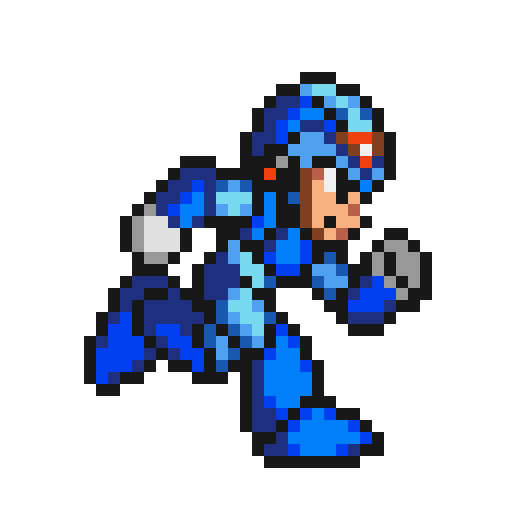

No visual changes, but now you can extract and get the whole image by sequence. 
<br>
Extract image from gif  (same convert binary): <br>

```convert output.gif images/m%02d.png```

Now create your reference palette :<br>

```martine -mode  0 -in images/m00.png -out reference -dsk```

Iterate on all png to create sprite for each images : <br>

```for i in images/m*.png; do martine -in "$i" -mode  0 -width 50 -height 50 -out sprites -pal reference/M000.PAL ; done ``` 

You will obtain in the sprites folder all sprites.

Compute the difference between images and ouput screen address (here the sprite will start at the address #D005): 

```martine -delta -df sprites/\*.WIN -out delta -address "#D005" -json```

Format your data : 

```prepare_delta -sprite sprites/m00.json -mode  0 -delta delta/\*.json -out data.asm ```

The assembly code can be compiled with Rasm from Roudoudou : 
```
;--- dimensions du sprite ----
large equ 100 / 2 
haut equ 100
;-----------------------------

org #1000
run $

start

    ; gestion du mode 
    ;ld bc,#7f8c
    ;out (c),c 
;--- selection du mode ---------
    ld a,0
    call #BC0E
;-------------------------------
  

;--- gestion de la palette ---- 
    call palettefirmware
;------------------------------

call xvbl

;--- affichage du sprite initiale --  
    ; affichage du premier sprite
    ld de,#C000 ; adresse de l'ecran 
    ld hl,sprite ; pointeur sur l'image en memoire 
    ld b, haut ; hauteur de l'image 
    loop 
    push bc ; sauve le compteur hauteur dans la pile 
    push de ; sauvegarde de l'adresse ecran dans la pile
    ld bc, large ; largeur de l'image a afficher
    ldir ; remplissage de n * largeur octets a l'adresse dans de 
    pop de ; recuperation de l'adresse d'origine 
    ex de,hl ; echange des valeurs des adresses
    call bc26 ; calcul de l'adresse de la ligne suivante
    ex de,hl ; echange des valeurs des adresses
    pop bc ; retabli le compteur 
    djnz loop
;------------------------------------
   

mainloop    ; routine pour afficher les deltas provenant de martine 

;call #bb06
call xvbl
ld hl,delta00
call delta

;call #bb06

call xvbl
ld hl,delta01
call delta

;call #bb06
call xvbl
ld hl,delta02
call delta

;call #bb06
call xvbl
ld hl,delta03
call delta

;call #bb06
call xvbl
ld hl,delta04
call delta

;call #bb06
call xvbl
ld hl,delta05
call delta

;call #bb06
call xvbl
ld hl,delta06
call delta

;call #bb06
call xvbl
ld hl,delta07
call delta

;call #bb06
call xvbl
ld hl,delta08
call delta

;call #bb06
call xvbl
ld hl,delta09
call delta


jp mainloop 


;--- routine de deltapacking --------------------------

delta
 ld a,(hl) ; nombre de byte a poker
 ld (nbbytepoked),a ; stockage en mémoire
 inc hl
init
 ld a,(hl) ; octet a poker
 ld (pixel),a
 inc hl
 ld c,(hl) ; nbfois
 inc hl 
 ld b,(hl)
 inc hl
;
poke_octet
 ld e,(hl)
 inc hl
 ld d,(hl) ; de=adresse
 inc hl
 ld a,(pixel)
 ld (de),a ; poke a l'adresse dans de
 dec bc
 ld a,b ; test a t'on poke toutes les adresses compteur bc
 or a 
 jr nz, poke_octet
 ld a,c 
 or a
 jr nz, poke_octet

 ld a,(nbbytepoked) ; reste t'il d'autres bytes a poker ? 
 dec a 
 ld (nbbytepoked),a
 jr nz,init
 ret


;---------------------------------------------------------------
;
; attente de plusieurs vbl
;
xvbl ld e,30
	call waitvbl
	dec e
	jr nz,xvbl+2
	ret
;-----------------------------------

;---- attente vbl ----------
waitvbl
    ld b,#f5 ; attente vbl
vbl     
    in a,(c)
    rra
    jp nc,vbl
    ret
;---------------------------

;--- application palette firmware -------------
palettefirmware ; hl pointe sur les valeurs de la palette
ld a,0
ld b,0
ld c,0
call #bc32

ld a,1
ld b,15
ld c,15
call #bc32

ld a,2
ld b,1
ld c,1
call #bc32

ld a,3
ld b,10
ld c,10
call #bc32

ld a,4
ld b,11
ld c,11
call #bc32

ld a,5
ld b,12
ld c,12
call #bc32

ld a,6
ld b,13
ld c,13
call #bc32

ld a,7
ld b,14
ld c,14
call #bc32

ld a,8
ld b,23
ld c,23
call #bc32

ld a,9
ld b,16
ld c,16
call #bc32

ld a,10
ld b,26
ld c,26
call #bc32


ret
;---------------------------------------------

;---- recuperation de l'adresse de la ligne en dessous ------------
bc26 
ld a,h
add a,8 
ld h,a ; <---- le fameux que tu as oublié !
ret nc 
ld bc,#c050 ; on passe en 96 colonnes
add hl,bc
res 3,h
ret
;-----------------------------------------------------------------


;--- variables memoires -----
pixel db 0 
nbbytepoked db 0
;----------------------------


;------- data ---------------------------

include 'data.asm'


end

save'delta.bin',#1000,end-start,DSK,'bomberman.dsk'

```

Now you can get the result here : [sna](samples/deltapacking-megaman/megaman.sna) or [dsk](samples/deltapacking-megaman/megaman.dsk)

You will obtain this : 

### Animation

Martine supports advanced animation workflows for creating sprite sequences and frame-based animations.

#### GIF to Animation
Process animated GIFs into sprite sequences:
```martine -in animation.gif -mode 0 -width 32 -height 32 -animate -out sprites_folder```

Options:
- `-animate` - Generate sprite sequence from GIF frames
- `-iter` - Control number of frames to process
- `-deltapacking` - Compress animation using delta packing (described above)
- `-fillout` - Fill missing frames during animation processing

#### Sprite Board Animation
Create walking/running animations from sprite sheets:
```martine -in spritesheet.png -tile -width 32 -height 32 -iterx 8 -itery 4 -mode 0 -out animation_output```

This extracts individual sprites from a grid layout.

#### Frame Interpolation
- Use `-fillout` to automatically generate intermediate frames
- Useful for smooth motion when original frame count is low

### Advanced Features

#### Hardware Integration (M4 Card)
For users with an M4 Card (WiFi-enabled CPC interface), martine can directly transfer files:

```martine -in image.png -mode 0 -host 192.168.1.100 -remotepath /mnt/sd -autoexec -dsk```

Options:
- `-host` - IP address or hostname of M4 Card
- `-remotepath` - Target directory on M4 Card SD card
- `-autoexec` - Automatically execute the generated program

#### Palette Management
Advanced palette operations:

**Ink Swapping** - Remap color indices:
```martine -in image.png -mode 0 -inkswap "0=3,1=0,2=1,3=2" -out output```

**Palette Application** - Apply existing palette:
```martine -in image.png -mode 0 -pal reference.pal -out output```

**Brightness & Contrast** (CPC Plus only):
```martine -in image.png -plus -brightness 50 -contrast 30 -out output```

#### Go Source Code Export
Export sprite data directly as Go source code:
```martine -in sprite.png -mode 0 -width 16 -height 16 -out golang_output```

Generates `.go1` and `.go2` files with sprite data encoded as Go byte arrays.

#### Data Format Options

**Column-based Layout** - Export data by columns instead of rows:
```martine -in image.png -mode 0 -out output -txt -json```

**Zigzag Ordering** - Alternative memory layout for optimized access patterns:
```martine -in tiles.png -tile -width 8 -height 8 -zigzag -out tiles_output```

**Custom Statement** - Change assembly notation:
```martine -in sprite.png -mode 0 -statement "defb" -txt -out output```

Choices: `db`, `defb`, `byte`

#### Color Processing

**Dithering Algorithms** - 10 algorithms available:
- `-dithering 0` - Floyd-Steinberg (default)
- `-dithering 10` - Bayer 8x8
- See usage help for all 15 algorithms

Example with Sierra dithering:
```martine -in photo.jpg -mode 1 -dithering 4 -out output```

**Color Reduction** - Pre-process colors before dithering:
```martine -in image.png -mode 0 -reducer 2 -dithering 0 -out output```

Levels: 1=lower, 2=medium, 3=strong

**Quantization** - Advanced color quantization:
```martine -in image.png -mode 0 -quantization -dithering 0 -out output```

Combines K-means clustering with optional dithering for better color mapping.

#### Resize Algorithms
Choose from 15 resize algorithms:
- 1: NearestNeighbor (default, fastest)
- 2: CatmullRom
- 3: Lanczos (highest quality)
- 4-15: Various interpolation methods

Example with high-quality resize:
```martine -in image.jpg -mode 0 -algo 3 -out output```

#### Sprite Masking
Apply bitwise operations to sprite data:

```martine -in sprite.png -width 16 -height 16 -mask "#AA" -maskand -mode 0 -out output```

This applies an AND operation with mask value 0xAA (binary 10101010).

Alternatives:
- `-maskand` - AND operation (mask bits that remain)
- `-maskor` - OR operation (set masked bits)

#### Tilemap Analysis
Advanced tilemap generation with optimization:
```martine -in level.png -tilemap -width 16 -height 16 -analyzetilemap -out level_output -dsk```

Features:
- Automatic tile duplicate detection
- Generates tilemap schema showing tile positions
- Creates tile usage statistics
- Exports ASM format tile maps

#### Process Files
Save and reuse conversion settings:

Create a process template:
```martine -initprocess myprocess.json```

Apply saved settings:
```martine -processfile myprocess.json -in newimage.png -out output```

#### Extended Disk Support
Generate extended CPC disk formats:
```martine -in image.png -mode 0 -extendeddsk -out output```

Supports:
- 80 tracks per face
- 10 sectors
- 400 KB per face
- Ideal for larger projects

#### Sprite Formats

**IMP-Catcher Format** - For Impdraw V2 compatibility:
```martine -in sprite.png -mode 0 -width 16 -height 16 -imp -out output```

**CPC Plus Sprite Hardware** - 16-bit sprites:
```martine -in sprite.png -plus -spritehard -width 16 -height 16 -out output```

**Reverse Engineering** - Convert CPC files back to PNG:
```martine -reverse -win sprite.win -pal sprite.pal -out output.png```

Or:
```martine -reverse -in screen.scr -pal screen.pal -out screen.png```

#### Address Configuration
Control memory addressing for sprites:
```martine -delta -df sprites/*.WIN -address "#C000" -out delta_output```

Use `-linewidth` for custom screen address calculations:
```martine -delta -df sprites/*.WIN -linewidth "#50" -out delta_output``` 
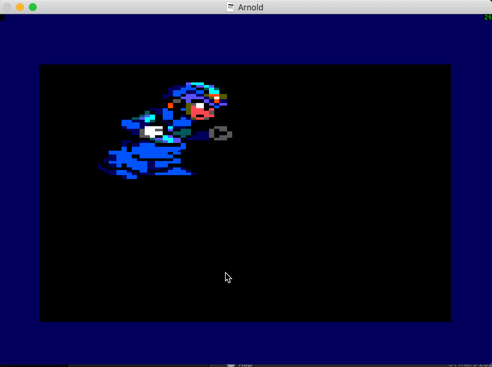